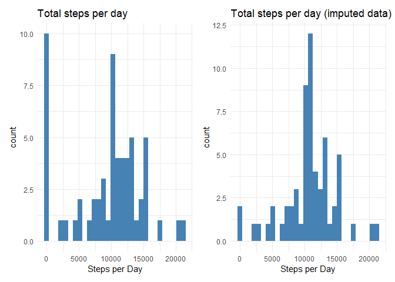
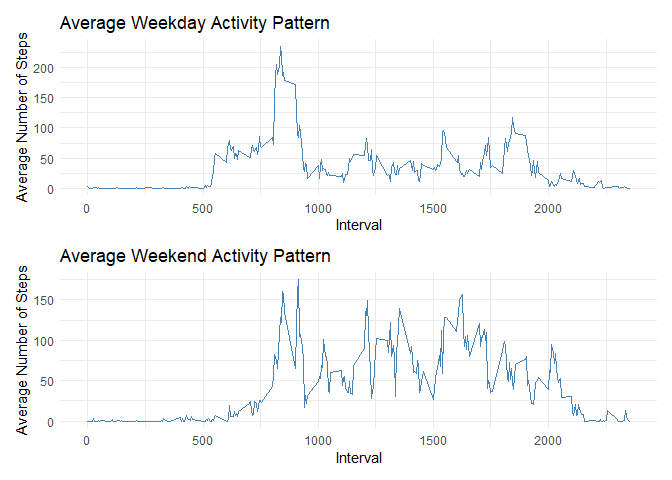

## Loading and preprocessing the data

```r
if (!file.exists("activity.csv")) {
        unzip("activity.zip")
}
```

```r
activity <- read.csv("activity.csv")
```

```r
library(tidyverse)
```

```
## -- Attaching packages --------------------------------------- tidyverse 1.3.0 --
```

```
## v ggplot2 3.3.3     v purrr   0.3.4
## v tibble  3.0.5     v dplyr   1.0.3
## v tidyr   1.1.2     v stringr 1.4.0
## v readr   1.4.0     v forcats 0.5.0
```

```
## -- Conflicts ------------------------------------------ tidyverse_conflicts() --
## x dplyr::filter() masks stats::filter()
## x dplyr::lag()    masks stats::lag()
```

```r
str(activity)
```

```
## 'data.frame':	17568 obs. of  3 variables:
##  $ steps   : int  NA NA NA NA NA NA NA NA NA NA ...
##  $ date    : chr  "2012-10-01" "2012-10-01" "2012-10-01" "2012-10-01" ...
##  $ interval: int  0 5 10 15 20 25 30 35 40 45 ...
```

```r
activity$date <- as.Date(activity$date, tryFormats = "%Y-%m-%d")
```

## What is mean total number of steps taken per day?


```r
h1 <- 
activity %>%
        select(- interval) %>%
        group_by(date) %>%
        summarise(steps = sum(steps, na.rm =T)) %>%
        ggplot() +
        geom_histogram(aes(steps),
                           fill = "steelblue",
                       position = "dodge")+
        theme_minimal() +
        labs(title = "Total steps per day",
             x = "Steps per Day"
        )
h1
```

```
## `stat_bin()` using `bins = 30`. Pick better value with `binwidth`.
```

<!-- -->

```r
sumsteps <-
activity%>%
        group_by(date) %>%
        summarise(steps = sum(steps, na.rm = T))

smean <- round(mean(sumsteps$steps), 2)
smedian <- median(sumsteps$steps)
```

Activity's daily Steps mean and median are the following **9354.23** and **10395**, respectively. 

## What is the average daily activity pattern?


```r
library(gganimate)
```

```r
activity %>%
        group_by(interval) %>%
        summarise(steps = mean(steps, na.rm =T)) %>%
        ggplot() +
        geom_line(aes(x = interval,
                     y = steps),
                 stat = "identity") +
        theme_minimal() +
        labs(title = "Average Daily Activity Pattern",
             x = "Interval",
             y = "Average Number of Steps") +
        transition_reveal(along = interval)
```

<!-- -->

```r
activity %>%
        group_by(interval) %>%
        summarise(steps = mean(steps, na.rm =T)) %>%
        filter(steps == max(steps))
```

```
## # A tibble: 1 x 2
##   interval steps
##      <int> <dbl>
## 1      835  206.
```

## Imputing missing values


```r
sapply(activity, function(x) sum(is.na(x)))
```

```
##    steps     date interval 
##     2304        0        0
```

```r
mvimpute <- function(data=data) {
        for (i in 1:ncol(data)) {
                if (class(data[,i]) %in% c("integer", "numeric")) {
                        if (sum(is.na(data[,i]))) {
                                data[is.na(data[,i]), i] <- mean(data[,i], na.rm =T)
                        }
                }
        }
        data <- as_tibble(data)
        data$date <- as.Date(data$date, tryFormats = "%Y-%m-%d")
        data
}
```

```r
NoNA.actv <- mvimpute(activity)

head(NoNA.actv)
```

```
## # A tibble: 6 x 3
##   steps date       interval
##   <dbl> <date>        <int>
## 1  37.4 2012-10-01        0
## 2  37.4 2012-10-01        5
## 3  37.4 2012-10-01       10
## 4  37.4 2012-10-01       15
## 5  37.4 2012-10-01       20
## 6  37.4 2012-10-01       25
```

```r
sapply(NoNA.actv, function(x) sum(is.na(x)))
```

```
##    steps     date interval 
##        0        0        0
```

```r
h2 <-
NoNA.actv %>%
        select(- interval) %>%
        group_by(date) %>%
        summarise(steps = sum(steps, na.rm =T)) %>%
        ggplot() +
        geom_histogram(aes(steps),
                           fill = "steelblue",
                       position = "dodge")+
        theme_minimal() +
        labs(title = "Total steps per day (imputed data)",
             x = "Steps per Day"
        )
```

```r
library(patchwork)

h1 | h2
```

```
## `stat_bin()` using `bins = 30`. Pick better value with `binwidth`.
## `stat_bin()` using `bins = 30`. Pick better value with `binwidth`.
```

<!-- -->

```r
sumsteps2 <-
NoNA.actv%>%
        group_by(date) %>%
        summarise(steps = sum(steps, na.rm = T))

smean2 <- format(mean(as.numeric(sumsteps2$steps)), scientific = F)
smedian2 <- format(median(as.numeric(sumsteps2$steps)), scientific = F)
```

Activity's daily Steps mean and median (after imputing missing values) are the following **10766.19** and **10766.19**, respectively. 

## Are there differences in activity patterns between weekdays and weekends?


```r
activity$wday <-  weekdays(activity$date)

activity <- 
activity %>%
  select(steps, interval, date, wday) %>%
  mutate(week = case_when(
      (grepl("(segunda|terça|quarta|quinta|sexta)-feira", activity$wday) == T) ~ "weekday",
      (grepl("(sábado|domingo)", activity$wday) == T) ~ "weekend"
))
```

```r
tsw1 <-
activity %>%
  group_by(week, interval) %>%
  summarise(steps = mean(steps, na.rm =T)) %>%
  filter(week == "weekday") %>%
  ggplot() +
  geom_line(aes(x = interval,
                y = steps),
                 color = "steelblue",  
                 stat = "identity") +
        theme_minimal() +
        labs(title = "Average Weekday Activity Pattern",
             x = "Interval",
             y = "Average Number of Steps") 
```

```
## `summarise()` has grouped output by 'week'. You can override using the `.groups` argument.
```

```r
tsw2 <-
activity %>%
  group_by(week, interval) %>%
  summarise(steps = mean(steps, na.rm =T)) %>%
  filter(week == "weekend") %>%
  ggplot() +
  geom_line(aes(x = interval,
                y = steps),
                 color = "steelblue",  
                 stat = "identity") +
        theme_minimal() +
        labs(title = "Average Weekend Activity Pattern",
             x = "Interval",
             y = "Average Number of Steps") 
```

```
## `summarise()` has grouped output by 'week'. You can override using the `.groups` argument.
```

```r
tsw1 / tsw2
```

<!-- -->


